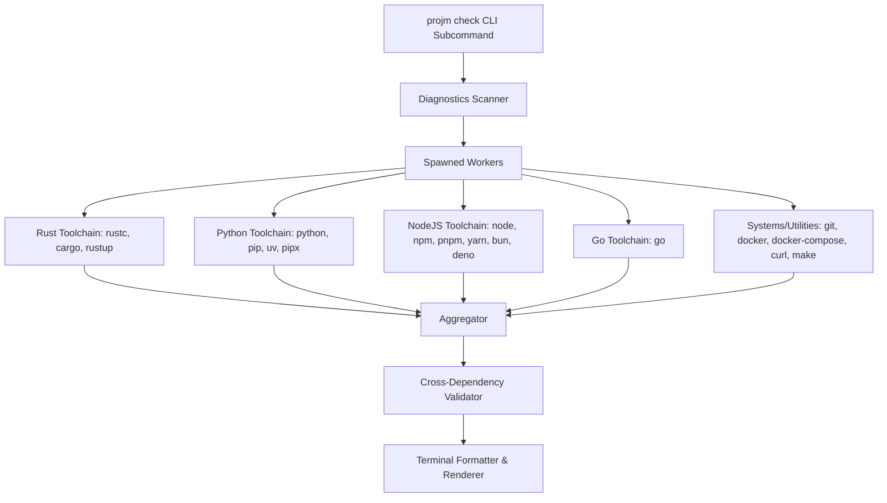

# Environment Diagnostics Design Spec

Implementation of `projm check`, a diagnostic command to inspect, verify, and report the status and versions of active compilers, runtimes, package managers, and development utilities in the user's `$PATH`.

## Goals
1. Provide a single, fast (`<100ms`) command to check local development environments.
2. Group checked tools logically: Rust, Python, Node/JS, Go, Systems/Utilities.
3. Show binary status, version numbers, and absolute paths beautifully in the terminal.
4. Perform smart cross-dependency validation (e.g. checking that runtime exists when a package manager is present) and report warnings.
5. Guarantee zero-crash execution by gracefully handling missing commands or failed process spawns.

## Architecture & Components



### 1. Tool Data Definitions (`src/check.rs`)

We will represent the list of tools statically to make it easily maintainable:

```rust
#[derive(Debug, Clone, Copy, PartialEq, Eq)]
pub enum ToolCategory {
    Rust,
    Python,
    NodeJS,
    Go,
    Systems,
}

impl ToolCategory {
    pub fn as_str(&self) -> &'static str {
        match self {
            Self::Rust => "Rust Toolchain",
            Self::Python => "Python Toolchain",
            Self::NodeJS => "Node/JS Toolchain",
            Self::Go => "Go Toolchain",
            Self::Systems => "Systems & Utilities",
        }
    }
}

pub struct Tool {
    pub name: &'static str,
    pub binary: &'static str,
    pub category: ToolCategory,
    pub version_args: &'static [&'static str],
}

pub static TOOLS: &[Tool] = &[
    // Rust
    Tool { name: "cargo", binary: "cargo", category: ToolCategory::Rust, version_args: &["--version"] },
    Tool { name: "rustc", binary: "rustc", category: ToolCategory::Rust, version_args: &["--version"] },
    Tool { name: "rustup", binary: "rustup", category: ToolCategory::Rust, version_args: &["--version"] },
    // Python
    Tool { name: "python", binary: "python3", category: ToolCategory::Python, version_args: &["--version"] },
    Tool { name: "pip", binary: "pip", category: ToolCategory::Python, version_args: &["--version"] },
    Tool { name: "uv", binary: "uv", category: ToolCategory::Python, version_args: &["--version"] },
    Tool { name: "pipx", binary: "pipx", category: ToolCategory::Python, version_args: &["--version"] },
    // Node/JS
    Tool { name: "node", binary: "node", category: ToolCategory::NodeJS, version_args: &["--version"] },
    Tool { name: "npm", binary: "npm", category: ToolCategory::NodeJS, version_args: &["--version"] },
    Tool { name: "pnpm", binary: "pnpm", category: ToolCategory::NodeJS, version_args: &["--version"] },
    Tool { name: "yarn", binary: "yarn", category: ToolCategory::NodeJS, version_args: &["--version"] },
    Tool { name: "bun", binary: "bun", category: ToolCategory::NodeJS, version_args: &["--version"] },
    Tool { name: "deno", binary: "deno", category: ToolCategory::NodeJS, version_args: &["--version"] },
    // Go
    Tool { name: "go", binary: "go", category: ToolCategory::Go, version_args: &["version"] },
    // Systems
    Tool { name: "git", binary: "git", category: ToolCategory::Systems, version_args: &["--version"] },
    Tool { name: "docker", binary: "docker", category: ToolCategory::Systems, version_args: &["--version"] },
    Tool { name: "docker-compose", binary: "docker-compose", category: ToolCategory::Systems, version_args: &["--version"] },
    Tool { name: "curl", binary: "curl", category: ToolCategory::Systems, version_args: &["--version"] },
    Tool { name: "make", binary: "make", category: ToolCategory::Systems, version_args: &["--version"] },
];
```

*Note on Python: We will first try to look for `python3`, and if missing, fall back to `python` binary checks.*

### 2. Path Finding Algorithm
We will find binary paths across platforms natively without external crates:
```rust
fn find_binary_path(binary: &str) -> Option<std::path::PathBuf> {
    if let Some(paths) = std::env::var_os("PATH") {
        for path in std::env::split_paths(&paths) {
            let candidate = path.join(binary);
            if candidate.is_file() {
                return Some(candidate);
            }
        }
    }
    None
}
```

### 3. Version Parsing & Standardizing
Version commands print varying prefix strings (e.g. `cargo 1.78.0 (54d84157b 2024-05-03)`, `Python 3.10.12`). We will standardize them using simple string processing to extract just the semantic-looking version sequence or clean first word of the number:
- Find any substring starting with a digit that has dots (e.g., `\d+\.\d+(\.\d+)?` equivalent logic in pure Rust or simply extracting the first word that starts with a digit after trimming).
- Keep it clean, lightweight, and robust.

### 4. Concurrency Model
Spawn a thread for each check, returning a structured diagnostic model:
```rust
pub struct DiagnosticResult {
    pub name: String,
    pub binary: String,
    pub category: ToolCategory,
    pub is_installed: bool,
    pub path: Option<std::path::PathBuf>,
    pub version: Option<String>,
}
```

### 5. Smart Cross-Dependency Warnings
Once results are collected, evaluate diagnostic status and populate recommendations:
- **Node.js**: If `npm`, `pnpm`, or `yarn` is present but `node` is not found → "Package manager `<name>` is installed but the Node.js runtime (`node`) is missing. Install Node.js to run JavaScript packages."
- **Python**: If `pip`, `uv`, or `pipx` is present but `python3` / `python` is not found → "Python tool `<name>` is installed but no Python runtime is active on `$PATH`."
- **Rust**: If `cargo` or `rustc` is present but `rustup` is not found → "Recommend installing `rustup` to manage your Rust compiler and toolchains efficiently."
- **Docker**: If `docker-compose` is present but `docker` is not found → "Docker Compose is installed but the Docker daemon/utility is missing."

---

## Verification Plan

### Automated Verification
* Unit tests in `src/check.rs` to verify path resolution helper.
* Unit tests for the version parsing functions with mock string inputs (e.g. testing `rustc 1.78.0`, `pip 22.0.2`, `go version go1.21.3 darwin/amd64`).

### Manual Verification
* Run `cargo run -- check` and confirm accurate status matching for the local environment.
