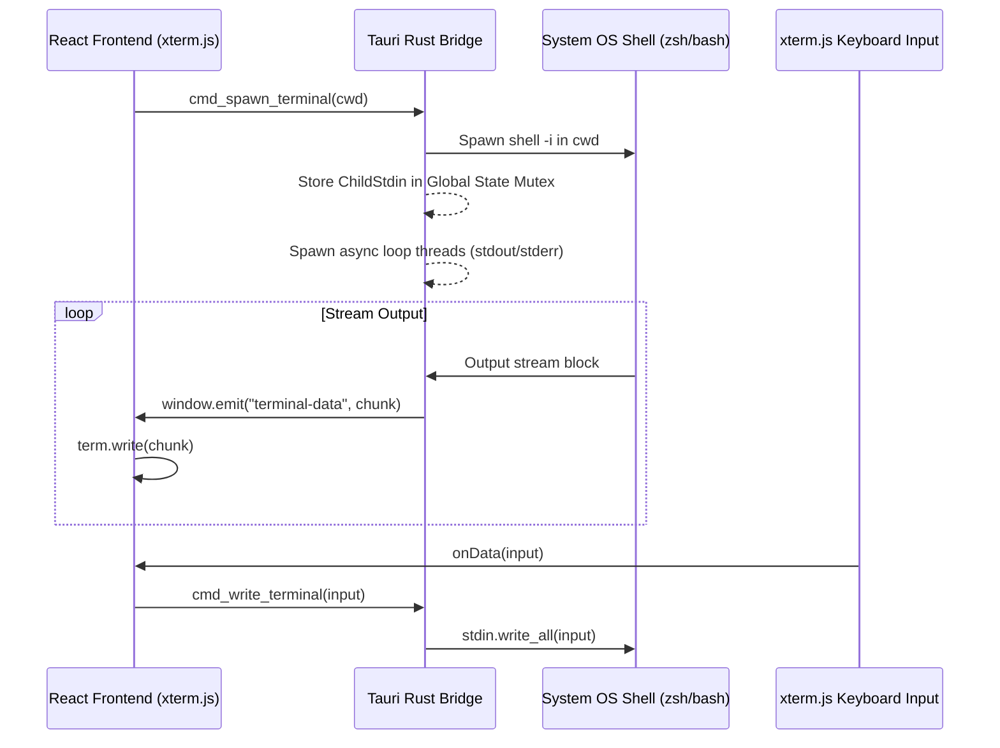

# Projm Embedded Terminal & Sleek Workspace UI Design Spec

**Date**: 2026-05-29  
**Status**: Approved  
**Topic**: High-Fidelity Double-Sidebar & Real Interactive Shell Terminal for Desktop App

---

## 1. Overview & Goals

The user wants to redesign the `projm` desktop GUI to look like a premium developer-centric editor workspace (similar to Zed or VS Code) with an integrated pseudo-terminal.

### Key Objectives:
1. **Premium Aesthetic**: Implement a sleek, dark oklch-based carbon theme matching modern developer tooling.
2. **Double Sidebar Navigation**:
   * **Far Left (Sidebar 1)**: Narrow category switcher (representing Apps, Services, UI, Tools, etc.) with active indicators.
   * **Tree View (Sidebar 2)**: Visual hierarchy of project directories inside the category, including Git branches and clean/dirty indicators.
3. **Embedded Real Live Terminal**:
   * Fully functional terminal pane on the right utilizing `xterm.js` that connects directly to spawned OS shells (`zsh` or `bash`) running natively in the active project's directory.

---

## 2. Visual Layout & Theming Specs

The styling is implemented in Next.js using Tailwind v4. The default aesthetic is dark and glassmorphic.

### Theme Variables (`globals.css`)
```css
:root {
  --background: oklch(0.12 0.01 250);
  --foreground: oklch(0.95 0.01 250);
  --card: oklch(0.15 0.01 250);
  --sidebar: oklch(0.14 0.01 250);
  --sidebar-border: oklch(1 0 0 / 8%);
  --accent: oklch(0.3 0.02 250);
  --accent-foreground: oklch(0.98 0.01 250);
  --muted-foreground: oklch(0.55 0.01 250);
}
```

### Layout Grid:
* **Height**: Forced to `100vh` to prevent window scrolling.
* **Narrow Icon Strip (Left)**: `48px` wide, absolute-centered avatars representing categories (`A`, `S`, `U`, `E`, `M`, `T`, `L`, `C`), plus Settings gear and Search.
* **Workspace Sidebar (Middle)**: `240px` wide list displaying the structured folder tree, Git branch name in soft green/yellow, and dirty status symbol (`*` or clean dot).
* **Workspace Main (Right)**: Flexible shell pane featuring tab bar, search input, and `xterm.js` canvas.

---

## 3. Tauri Rust Terminal Bridge Architecture

To pipe terminal inputs/outputs cleanly between the Rust OS process and the Javascript React frontend without heavy third-party native libraries, we implement a custom asynchronous stdin/stdout stream.



### 1. Tauri Backend Commands
We expose the following endpoints in `src-tauri/src/lib.rs`:
* `cmd_spawn_terminal(cwd: String)`: Spawns an interactive shell inside `cwd` and spins up asynchronous read loops that pipe standard streams to `window.emit`.
* `cmd_write_terminal(input: String)`: Writes the terminal input payload directly to the spawned shell's standard input.
* `cmd_list_projects()`: Reads and structures the organized directories inside the base directory, parsing active git branch and dirty status.

### 2. Frontend Connection
We install `xterm` and `xterm-addon-fit` inside the Next.js `app` workspace to render and layout the canvas, binding keys and listeners.

---

## 4. Verification Plan

### Manual Verification Steps:
1. Launch `cargo tauri dev` and verify that the GUI theme boots into the charcoal dark design.
2. Select a category (e.g. `Apps`) on Left Sidebar 1. Ensure Left Sidebar 2 updates with projects.
3. Click a project from the tree. Verify that:
   * A new project tab appears.
   * A real live terminal opens up, pointing to the project's exact directory path.
   * Running interactive terminal actions (e.g., `ls -la`, `git status`, `echo "hello"`, `npm --version`) works perfectly.
   * Auto-completes (Tab) and backspaces render correctly.
4. Verify that window resizes adjust the `xterm` layout cleanly.
